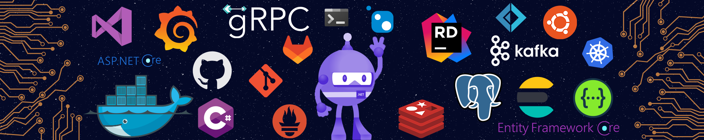

<h1 align="center">👋 Welcome </h1>

Hello random user! Welcome to my Github profile. Here, you can find my personal projects :)

### 👨🏻‍💻 About me

I'm a software engineer focusing on web applications with microservice architecture

Proficient: ASP.NET Core, C#

[comment]: <> (- 🔭 I’m currently working on ...)

- 🌱 I’m currently learning C#
- 👯 I’m looking to collaborate on C#
- 🤔 I’m looking for help with k8s

[comment]: <> (- 💬 Ask me about ...)

[comment]: <> (- 📫 How to reach me: ...)

[comment]: <> (- 😄 Pronouns: ...)

[comment]: <> (- ⚡ Fun fact: ...)

### Badges

### ⚙️ GitHub Analytics

[comment]: <> (### Languages and tools)

[comment]: <> ( ![C#]&#40;https://img.shields.io/badge/-ASP_NET_Core-090909>&#41;)

[comment]: <> ( ![C++]&#40;https://img.shields.io/badge/-C++-090909>&#41;)
